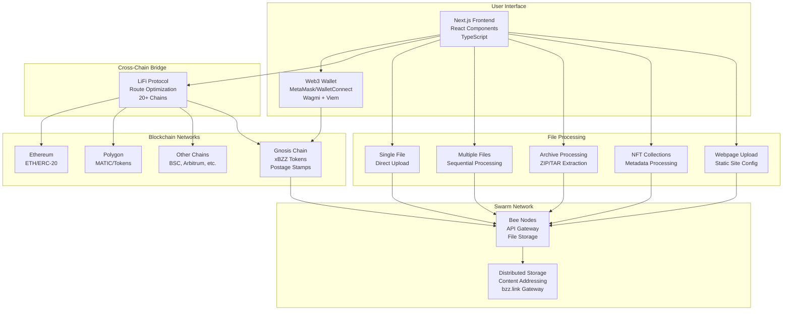

# Project Architecture Guide

## Overview

This Swarm upload application is a Next.js-based decentralized file storage platform that integrates multiple blockchain networks and services to provide seamless file uploads to the Swarm network. The architecture combines Web3 wallet connectivity, cross-chain bridging, and decentralized storage in a user-friendly interface.

## High-Level Architecture

The application follows a modular architecture that separates concerns between user interface, blockchain interactions, cross-chain bridging, and decentralized storage:



## Core Components

### 1. Frontend Application (Next.js)

**Technology Stack:**

- **Framework**: Next.js 14 with App Router
- **Language**: TypeScript
- **Styling**: CSS Modules
- **State Management**: React Hooks (useState, useEffect)

**Key Components:**

```
src/app/
├── components/
│   ├── SwapComponent.tsx           # Main upload interface
│   ├── FileUploadUtils.ts          # Upload logic and utilities
│   ├── NFTCollectionProcessor.ts   # NFT collection processing
│   ├── ArchiveProcessor.ts         # ZIP/TAR file handling
│   └── css/                        # Component styles
├── page.tsx                        # Main application page
└── layout.tsx                      # Root layout
```

### 2. Web3 Integration Layer

**Wallet Connectivity:**

- **Primary**: Wagmi v2 for React hooks
- **Wallet Support**: MetaMask, WalletConnect, Coinbase Wallet
- **Chain Management**: Multi-chain support with automatic switching

**Key Libraries:**

```json
{
  "wagmi": "^2.x", // Web3 React hooks
  "viem": "^2.x", // Ethereum client
  "@rainbow-me/rainbowkit": "^2.x" // Wallet connection UI
}
```

### 3. Cross-Chain Bridge Integration (LiFi)

**LiFi Service Integration:**

- **Purpose**: Enable cross-chain token transfers to fund Swarm operations
- **Supported Chains**: 20+ blockchain networks
- **Token Support**: Native tokens and ERC-20 tokens
- **Route Optimization**: Automatic best route finding

**Integration Points:**

```typescript
// LiFi SDK Integration
import { LiFi } from '@lifi/sdk';

// Route calculation
const routes = await lifi.getRoutes({
  fromChainId: sourceChain,
  toChainId: gnosisChainId,
  fromTokenAddress: sourceToken,
  toTokenAddress: xBZZToken,
  fromAmount: amount,
});
```

### 4. Swarm Network Integration

**Bee API Integration:**

- **Upload Endpoint**: Direct integration with Bee node APIs
- **Postage Stamps**: Management of storage credits
- **File References**: Handling of Swarm content addresses

**Upload Flow:**

```typescript
// File upload to Swarm
const uploadToSwarm = async (file: File, stamp: string) => {
  const formData = new FormData();
  formData.append('file', file);

  const response = await fetch(`${beeApiUrl}/bzz`, {
    method: 'POST',
    headers: {
      'swarm-postage-batch-id': stamp,
      'swarm-deferred-upload': 'false',
    },
    body: formData,
  });

  return response.json(); // Returns { reference: "hash..." }
};
```

## Data Flow Architecture

### 1. User Onboarding Flow

```
User Connects Wallet
        ↓
Wallet Detection & Chain Verification
        ↓
Balance Check (xBZZ tokens)
        ↓
[If insufficient] → LiFi Bridge Integration
        ↓
Postage Stamp Management
        ↓
Ready for File Upload
```

### 2. File Upload Flow

```
File Selection
        ↓
File Type Detection & Validation
        ↓
Processing Options Selection
        ↓
Postage Stamp Selection
        ↓
File Processing (if needed)
        ↓
Upload to Swarm Network
        ↓
Reference Generation & Storage
        ↓
Success Confirmation
```

### 3. Cross-Chain Bridge Flow

```
Source Chain Selection
        ↓
Token & Amount Input
        ↓
LiFi Route Calculation
        ↓
Route Optimization & Fee Display
        ↓
User Approval & Transaction
        ↓
Cross-Chain Transfer Execution
        ↓
Destination Chain Confirmation
        ↓
Balance Update
```

## Third-Party Services Integration

### 1. LiFi Protocol

**Service Type**: Cross-chain bridge aggregator
**Purpose**: Enable users to bridge tokens from any supported chain to Gnosis Chain for xBZZ

**Integration Details:**

- **SDK**: `@lifi/sdk` for route calculation and execution
- **Supported Chains**: Ethereum, Polygon, Arbitrum, Optimism, BSC, Avalanche, and 15+ more
- **Token Support**: Native tokens (ETH, MATIC, BNB) and major ERC-20 tokens
- **Features**:
  - Automatic route optimization
  - Gas estimation
  - Transaction status tracking
  - Slippage protection

**API Endpoints Used:**

```typescript
// Route calculation
GET / v1 / quote;
POST / v1 / quote / contractCallsQuote;

// Transaction execution
POST / v1 / transactions;
GET / v1 / transactions / { txHash } / status;
```

### 2. Swarm Network (Bee Nodes)

**Service Type**: Decentralized storage network
**Purpose**: Store files in a distributed, censorship-resistant manner

**Integration Details:**

- **API**: Direct HTTP API calls to Bee nodes
- **Endpoints Used**:
  - `POST /bzz` - Upload files
  - `GET /bzz/{reference}` - Retrieve files (via gateway)
  - `GET /stamps/{id}` - Get stamp information
  - `GET /stamps` - List stamps

**Configuration:**

```typescript
const beeApiUrl = process.env.NEXT_PUBLIC_BEE_API_URL || 'https://api.gateway.ethswarm.org';
const beeDebugUrl = process.env.NEXT_PUBLIC_BEE_DEBUG_URL || 'https://api.gateway.ethswarm.org';
```

### 3. Blockchain Networks

**Primary Network**: Gnosis Chain

- **Purpose**: Postage stamp transactions and xBZZ token operations
- **RPC**: Multiple providers for redundancy
- **Chain ID**: 100

**Supported Networks** (via LiFi):

- Ethereum Mainnet (Chain ID: 1)
- Polygon (Chain ID: 137)
- Arbitrum One (Chain ID: 42161)
- Optimism (Chain ID: 10)
- Binance Smart Chain (Chain ID: 56)
- Avalanche (Chain ID: 43114)
- And 15+ additional networks

### 4. Web3 Infrastructure

**RPC Providers:**

- **Primary**: Alchemy, Infura
- **Fallback**: Public RPC endpoints
- **Load Balancing**: Automatic failover between providers

**Wallet Providers:**

- **MetaMask**: Browser extension integration
- **WalletConnect**: Mobile wallet support
- **Coinbase Wallet**: Native Coinbase integration
- **Rainbow Wallet**: Via RainbowKit

## File Processing Architecture

### 1. Single File Upload

```
File Input → Validation → Direct Upload → Swarm Reference
```

### 2. Multiple File Upload

```
File Array → Sequential Processing → Individual References → Batch Results
```

### 3. Archive Processing

```
ZIP/TAR File → Extraction → File Organization → TAR Creation → Upload
```

### 4. NFT Collection Processing

```
ZIP File → Validation → Image Extraction → Metadata Processing →
URL Rewriting → Dual Upload (Images + Metadata) → Dual References
```

### 5. Webpage Upload

```
Archive File → Extraction → Web Configuration → Index Setup →
Error Page Setup → Upload with Web Headers
```

## Security Architecture

### 1. Wallet Security

- **Private Key Management**: Never stored or transmitted
- **Transaction Signing**: Local wallet signing only
- **Permission Model**: Explicit user approval for all transactions

### 2. File Upload Security

- **Client-Side Processing**: All file processing happens in browser
- **No Server Storage**: Files go directly to Swarm network
- **Validation**: File type and size validation before upload

### 3. Cross-Chain Security

- **LiFi Integration**: Trusted bridge aggregator with security audits
- **Transaction Verification**: On-chain verification of all transfers
- **Slippage Protection**: Automatic protection against MEV attacks

## Performance Optimizations

### 1. Frontend Optimizations

- **Code Splitting**: Dynamic imports for large components
- **Bundle Optimization**: Tree shaking and minification
- **Caching**: Browser caching for static assets
- **Lazy Loading**: Components loaded on demand

### 2. Upload Optimizations

- **Streaming Uploads**: Large files uploaded in chunks
- **Parallel Processing**: Multiple operations where possible
- **Progress Tracking**: Real-time upload progress
- **Retry Logic**: Automatic retry for failed uploads

### 3. Network Optimizations

- **RPC Load Balancing**: Multiple providers for reliability
- **Connection Pooling**: Reuse connections where possible
- **Timeout Management**: Dynamic timeouts based on file size
- **Error Recovery**: Graceful handling of network issues

## Deployment Architecture

### 1. Frontend Deployment

- **Platform**: Vercel (recommended) or similar
- **Build Process**: Next.js static generation
- **Environment Variables**: Secure configuration management
- **CDN**: Global content delivery for static assets

### 2. Configuration Management

```typescript
// Environment Variables
NEXT_PUBLIC_BEE_API_URL=https://api.gateway.ethswarm.org
NEXT_PUBLIC_BEE_DEBUG_URL=https://api.gateway.ethswarm.org
NEXT_PUBLIC_LIFI_API_URL=https://li.quest/v1
NEXT_PUBLIC_DEFAULT_CHAIN_ID=100
```

### 3. Monitoring & Analytics

- **Error Tracking**: Browser error monitoring
- **Performance Monitoring**: Core Web Vitals tracking
- **Usage Analytics**: User interaction tracking
- **Uptime Monitoring**: Service availability monitoring

## Development Workflow

### 1. Local Development

```bash
# Install dependencies
npm install

# Start development server
npm run dev

# Build for production
npm run build

# Type checking
npm run type-check

# Linting
npm run lint
```

### 2. Testing Strategy

- **Unit Tests**: Component and utility function testing
- **Integration Tests**: Web3 integration testing
- **E2E Tests**: Full user flow testing
- **Manual Testing**: Cross-browser compatibility

### 3. Code Organization

```
src/
├── app/                    # Next.js app directory
│   ├── components/         # React components
│   ├── hooks/             # Custom React hooks
│   ├── utils/             # Utility functions
│   └── types/             # TypeScript type definitions
├── public/                # Static assets
└── docs/                  # Documentation
```

---

_This architecture documentation provides a comprehensive overview of the project structure and integrations. For specific implementation details, refer to the individual component guides._
