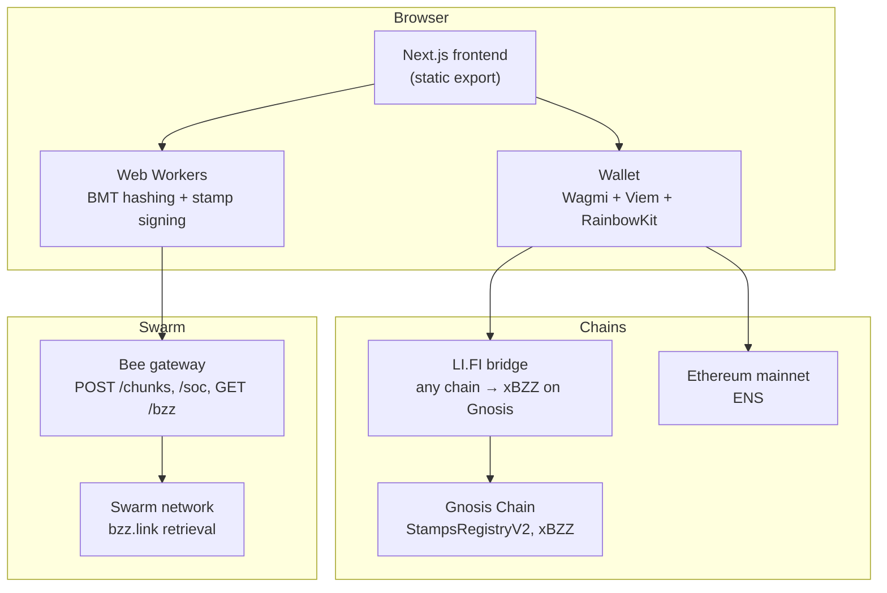

# Architecture

Beeport is a Next.js dapp that uploads files to Swarm with **self-custody stamping**: chunks are BMT-hashed and postage-stamped in the browser, and the Bee gateway only ever sees pre-stamped chunks. There is **no application backend** — the browser talks directly to a Bee gateway over HTTPS, and to blockchains via the user's wallet.

Deep dives: [Self-custody hot key](./self-custody-hot-key.md), [Client-side chunk pipeline](./client-side-chunk-pipeline.md), [Chunk transport](./chunk-transport-http-vs-websocket.md), [Wallet security](./wallet-security.md).

## High-level view


```mermaid
graph TB
    subgraph "Browser"
        UI["Next.js frontend<br/>(static export)"]
        Wallet["Wallet<br/>Wagmi + Viem + RainbowKit"]
        Workers["Web Workers<br/>BMT hashing + stamp signing"]
    end

    subgraph "Chains"
        LiFi["LI.FI bridge<br/>any chain → xBZZ on Gnosis"]
        Gnosis["Gnosis Chain<br/>StampsRegistryV2, xBZZ"]
        Mainnet["Ethereum mainnet<br/>ENS"]
    end

    subgraph "Swarm"
        Bee["Bee gateway<br/>POST /chunks, /soc, GET /bzz"]
        Net["Swarm network<br/>bzz.link retrieval"]
    end

    UI --> Wallet
    UI --> Workers
    Wallet --> LiFi --> Gnosis
    Wallet --> Mainnet
    Workers --> Bee --> Net
```

## Key components

```
src/app/components/
├── SwapComponent.tsx              # Main upload UI / orchestration
├── ClientSideUpload.ts            # BMT chunking, AsyncQueue parallelism, manifest, readiness probe
├── ClientStamping.ts              # Stamper state, IndexedDB persistence
├── HotKeySession.ts               # Session unlock, idle lock, worker key handoff
├── FastPresignedStamp.ts          # Stamp envelope + fetch to /chunks and /soc; WS stream pool
├── BmtWorkerClient.ts             # Off-main-thread BMT hashing wrapper
├── SelfCustodyBatch.ts            # On-chain createBatch (StampsRegistryV2)
├── IssuerStateSOC.ts              # Encrypted issuer-state backup SOC
├── BeeApi.ts                      # /chainstate, /batches, /stamps helpers
├── BeeNodeHealth.ts               # Pre-upload gateway health probe
├── GatewayChainSync.ts            # Wait for gateway chain listener after createBatch
├── NFTCollectionClientSide.ts     # NFT collection metadata processing
├── FolderArchiveExtract.ts        # ZIP/TAR extraction + auto-index generation
└── StampListSection.tsx / UploadHistorySection.tsx / ENSIntegration.tsx
src/workers/
├── bmtWorker.ts                   # MerkleTree hashing off the main thread
└── stampSignerWorker.ts           # Stamp signing; holds the hot-key scalar
```

## Bee API usage

| Endpoint | Purpose |
| -------- | ------- |
| `POST /chunks` | Pre-stamped CAC chunks (HTTP transport) |
| `wss /chunks/stream` | WebSocket chunk transport (Bee v2.8.1+, large uploads) |
| `POST /soc/{owner}/{id}?sig=…` | Issuer-state backup SOC |
| `GET /bzz/{reference}` | Retrieval / post-upload verification |
| `GET /stamps/{id}`, `GET /batches/{id}` | Stamp / batch metadata |
| `GET /health`, `GET /chainstate` | Gateway probes |

Gateway URL comes from `NEXT_PUBLIC_DEFAULT_BEE_API_URL` (default `https://beeport.xyz`, see `DEFAULT_BEE_API_URL` in `src/app/components/constants.ts`). Retrieval links use `BEE_GATEWAY_URL` (`bzz.link` on production domains). All env knobs are listed in `.env.local.example`.

## Upload flow (self-custody)

```
File selection
      ↓
ensureHotKey() — one wallet signature per session
      ↓
Optional archive / folder processing (extract, filter, index)
      ↓
Stamp-readiness probe (fresh batches: wait for gateway to index createBatch)
      ↓
BMT chunking (worker) + per-chunk stamp (worker pool) + POST /chunks or WS stream
      ↓
Manifest reference + deferred issuer-state SOC backup
```

## Buying storage

Any-chain tokens are bridged to xBZZ on Gnosis via the **LI.FI SDK** (route quotes, execution, status tracking). `createBatch` is then called on **StampsRegistryV2** with the hot key as batch owner. ENS content-hash linking runs on Ethereum mainnet — see [ENS integration](./ens-integration.md).

## Deployment

Production builds use Next.js **static export** (`output: 'export'` in `next.config.mjs`) served by nginx, which also proxies the Bee gateway endpoints — see [Self-hosting a Bee gateway](./self-hosting-bee-gateway.md). Workers require an absolute `output.workerPublicPath` (`/_next/`) because the export uses a relative `assetPrefix`.

## Local development

```bash
npm install
npm run dev     # dev server on :3000
npm run build   # static export to out/
```

Point `NEXT_PUBLIC_DEFAULT_BEE_API_URL` at a local Bee node (`http://localhost:1633`) or a CORS-enabled gateway.
