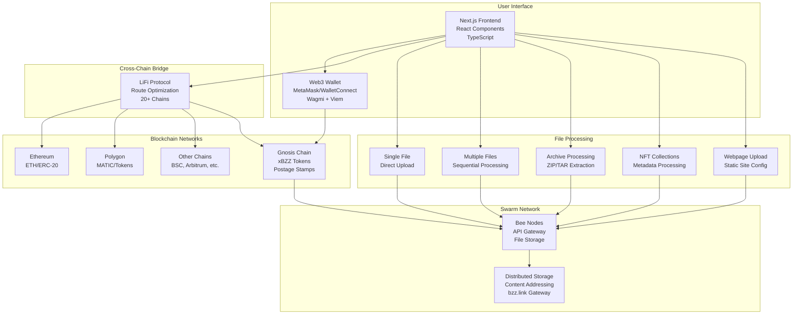

# Project Architecture Guide

## Overview

This Swarm upload application is a Next.js-based decentralized file storage platform that integrates multiple blockchain networks and services to provide seamless file uploads to the Swarm network. The architecture combines Web3 wallet connectivity, cross-chain bridging, and decentralized storage in a user-friendly interface.

**Self-custody uploads** (per-chunk stamping in the browser, gateway sees only pre-stamped chunks) are documented in [Self-custody hot key](./self-custody-hot-key.md) and [Client-side chunk pipeline](./client-side-chunk-pipeline.md).

## High-level architecture

The application follows a modular architecture that separates concerns between user interface, blockchain interactions, cross-chain bridging, and decentralized storage:


```mermaid
graph TB
    subgraph "User Interface"
        UI["Next.js Frontend<br/>React Components<br/>TypeScript"]
        Wallet["Web3 Wallet<br/>MetaMask/WalletConnect<br/>Wagmi + Viem"]
    end

    subgraph "Cross-Chain Bridge"
        LiFi["LiFi Protocol<br/>Route Optimization<br/>20+ Chains"]
    end

    subgraph "Blockchain Networks"
        Gnosis["Gnosis Chain<br/>xBZZ Tokens<br/>Postage Stamps"]
        Ethereum["Ethereum<br/>ETH/ERC-20"]
        Polygon["Polygon<br/>MATIC/Tokens"]
        Other["Other Chains<br/>BSC, Arbitrum, etc."]
    end

    subgraph "Swarm Network"
        Bee["Bee Nodes<br/>API Gateway<br/>File Storage"]
        Storage["Distributed Storage<br/>Content Addressing<br/>bzz.link Gateway"]
    end

    subgraph "File Processing"
        Single["Single File<br/>Direct Upload"]
        Multi["Multiple Files<br/>Sequential Processing"]
        Archive["Archive Processing<br/>ZIP/TAR Extraction"]
        NFT["NFT Collections<br/>Metadata Processing"]
        Web["Webpage Upload<br/>Static Site Config"]
    end

    UI --> Wallet
    UI --> LiFi
    UI --> Single
    UI --> Multi
    UI --> Archive
    UI --> NFT
    UI --> Web

    Wallet --> Gnosis
    LiFi --> Ethereum
    LiFi --> Polygon
    LiFi --> Other
    LiFi --> Gnosis

    Gnosis --> Bee
    Single --> Bee
    Multi --> Bee
    Archive --> Bee
    NFT --> Bee
    Web --> Bee

    Bee --> Storage
```

## Core Components

### 1. Frontend Application (Next.js)

**Technology Stack:**

- **Framework**: Next.js 14 with App Router
- **Language**: TypeScript
- **Styling**: CSS Modules
- **State Management**: React Hooks (useState, useEffect)

**Key Components:**

```
src/app/
├── components/
│   ├── SwapComponent.tsx              # Main upload UI / orchestration
│   ├── ClientSideUpload.ts            # BMT chunking, manifest, upload orchestration
│   ├── ClientStamping.ts              # Stamper state, IndexedDB persistence
│   ├── HotKeySession.ts               # Session unlock, idle lock, worker key handoff
│   ├── FastPresignedStamp.ts          # Stamp envelope + fetch to /chunks and /soc
│   ├── SelfCustodyBatch.ts            # On-chain createBatch (StampsRegistryV2)
│   ├── IssuerStateSOC.ts              # Encrypted issuer-state backup SOC
│   ├── BeeNodeHealth.ts               # Pre-upload gateway health probe
│   ├── NFTCollectionClientSide.ts     # NFT collection metadata processing
│   ├── FolderArchiveExtract.ts        # ZIP/TAR extraction + auto-index generation
│   └── css/                           # Component styles
├── page.tsx                           # Main application page
└── layout.tsx                         # Root layout
```

### 2. Web3 Integration Layer

**Wallet Connectivity:**

- **Primary**: Wagmi v2 for React hooks
- **Wallet Support**: MetaMask, WalletConnect, Coinbase Wallet
- **Chain Management**: Multi-chain support with automatic switching

**Key Libraries:**

```json
{
  "wagmi": "^2.x", // Web3 React hooks
  "viem": "^2.x", // Ethereum client
  "@rainbow-me/rainbowkit": "^2.x" // Wallet connection UI
}
```

### 3. Cross-Chain Bridge Integration (LiFi)

**LiFi Service Integration:**

- **Purpose**: Enable cross-chain token transfers to fund Swarm operations
- **Supported Chains**: 20+ blockchain networks
- **Token Support**: Native tokens and ERC-20 tokens
- **Route Optimization**: Automatic best route finding

**Integration Points:**

```typescript
// LiFi SDK Integration
import { LiFi } from '@lifi/sdk';

// Route calculation
const routes = await lifi.getRoutes({
  fromChainId: sourceChain,
  toChainId: gnosisChainId,
  fromTokenAddress: sourceToken,
  toTokenAddress: xBZZToken,
  fromAmount: amount,
});
```

### 4. Swarm Network Integration

**Self-custody upload path (primary):**

- Chunks are BMT-hashed and postage-stamped in the browser (hot key owns the batch).
- Leaf chunks: `POST /chunks` with `Swarm-Postage-Stamp` header (`FastPresignedStamp.ts`).
- Issuer-state backup SOC: `POST /soc/{owner}/{identifier}?sig=…` — not `/chunks`.
- Manifest assembly and Mantaray trees: `ClientSideUpload.ts`.
- bee-js is used for helpers (chunk construction, reads); hot-path uploads use `fetch`, not axios.

**Other Bee API usage:**

- `GET /bzz/{reference}` — retrieval via gateway
- `GET /stamps`, `GET /stamps/{id}` — stamp metadata
- `GET /health`, `GET /chainstate` — gateway probes

**Configuration:**

```typescript
const beeApiUrl = process.env.NEXT_PUBLIC_BEE_API_URL || 'https://api.gateway.ethswarm.org';
```

See [Client-side chunk pipeline](./client-side-chunk-pipeline.md) and [Self-hosting a Bee gateway](./self-hosting-bee-gateway.md).

## Data Flow Architecture

### 1. User Onboarding Flow

```
User Connects Wallet
        ↓
Wallet Detection & Chain Verification
        ↓
Balance Check (xBZZ tokens)
        ↓
[If insufficient] → LiFi Bridge Integration
        ↓
Postage Stamp Management
        ↓
Ready for File Upload
```

### 2. File Upload Flow (self-custody)

```
File Selection
        ↓
ensureHotKey() — one wallet signature per session
        ↓
Optional archive / folder processing
        ↓
BMT chunking + per-chunk stamp (workers) + POST /chunks
        ↓
Manifest reference + optional issuer-state SOC backup
        ↓
Success confirmation
```

### 3. Cross-Chain Bridge Flow

```
Source Chain Selection
        ↓
Token & Amount Input
        ↓
LiFi Route Calculation
        ↓
Route Optimization & Fee Display
        ↓
User Approval & Transaction
        ↓
Cross-Chain Transfer Execution
        ↓
Destination Chain Confirmation
        ↓
Balance Update
```

## Third-Party Services Integration

### 1. LiFi Protocol

**Service Type**: Cross-chain bridge aggregator
**Purpose**: Enable users to bridge tokens from any supported chain to Gnosis Chain for xBZZ

**Integration Details:**

- **SDK**: `@lifi/sdk` for route calculation and execution
- **Supported Chains**: Ethereum, Polygon, Arbitrum, Optimism, BSC, Avalanche, and 15+ more
- **Token Support**: Native tokens (ETH, MATIC, BNB) and major ERC-20 tokens
- **Features**:
  - Automatic route optimization
  - Gas estimation
  - Transaction status tracking
  - Slippage protection

**API Endpoints Used:**

```typescript
// Route calculation
GET / v1 / quote;
POST / v1 / quote / contractCallsQuote;

// Transaction execution
POST / v1 / transactions;
GET / v1 / transactions / { txHash } / status;
```

### 2. Swarm Network (Bee Nodes)

**Service Type**: Decentralized storage network
**Purpose**: Store files in a distributed, censorship-resistant manner

**Integration Details:**

- **API**: HTTP to Bee gateways (browser-direct; no app backend)
- **Primary upload endpoints**:
  - `POST /chunks` — pre-stamped CAC chunks (self-custody)
  - `POST /soc/{owner}/{id}` — issuer-state and other SOCs
  - `GET /bzz/{reference}` — retrieve via gateway
  - `GET /stamps/{id}`, `GET /stamps` — stamp information

**Configuration:**

```typescript
const beeApiUrl = process.env.NEXT_PUBLIC_BEE_API_URL || 'https://api.gateway.ethswarm.org';
const beeDebugUrl = process.env.NEXT_PUBLIC_BEE_DEBUG_URL || 'https://api.gateway.ethswarm.org';
```

### 3. Blockchain Networks

**Primary Network**: Gnosis Chain

- **Purpose**: Postage stamp transactions and xBZZ token operations
- **RPC**: Multiple providers for redundancy
- **Chain ID**: 100

**Supported Networks** (via LiFi):

- Ethereum Mainnet (Chain ID: 1)
- Polygon (Chain ID: 137)
- Arbitrum One (Chain ID: 42161)
- Optimism (Chain ID: 10)
- Binance Smart Chain (Chain ID: 56)
- Avalanche (Chain ID: 43114)
- And 15+ additional networks

### 4. Web3 Infrastructure

**RPC Providers:**

- **Primary**: Alchemy, Infura
- **Fallback**: Public RPC endpoints
- **Load Balancing**: Automatic failover between providers

**Wallet Providers:**

- **MetaMask**: Browser extension integration
- **WalletConnect**: Mobile wallet support
- **Coinbase Wallet**: Native Coinbase integration
- **Rainbow Wallet**: Via RainbowKit

## File Processing Architecture

### 1. Single File Upload

```
File Input → Validation → Direct Upload → Swarm Reference
```

### 2. Multiple File Upload

```
File Array → Sequential Processing → Individual References → Batch Results
```

### 3. Archive Processing

```
ZIP/TAR File → Extraction → File Organization → TAR Creation → Upload
```

### 4. NFT Collection Processing

```
ZIP File → Validation → Image Extraction → Metadata Processing →
URL Rewriting → Dual Upload (Images + Metadata) → Dual References
```

### 5. Webpage Upload

```
Archive File → Extraction → Web Configuration → Index Setup →
Error Page Setup → Upload with Web Headers
```

## Security Architecture

### 1. Wallet Security

- **Private Key Management**: Never stored or transmitted
- **Transaction Signing**: Local wallet signing only
- **Permission Model**: Explicit user approval for all transactions

### 2. File Upload Security

- **Client-Side Processing**: All file processing happens in browser
- **No Server Storage**: Files go directly to Swarm network
- **Validation**: File type and size validation before upload

### 3. Cross-Chain Security

- **LiFi Integration**: Trusted bridge aggregator with security audits
- **Transaction Verification**: On-chain verification of all transfers
- **Slippage Protection**: Automatic protection against MEV attacks

## Performance Optimizations

### 1. Frontend Optimizations

- **Code Splitting**: Dynamic imports for large components
- **Bundle Optimization**: Tree shaking and minification
- **Caching**: Browser caching for static assets
- **Lazy Loading**: Components loaded on demand

### 2. Upload Optimizations

- **Streaming Uploads**: Large files uploaded in chunks
- **Parallel Processing**: Multiple operations where possible
- **Progress Tracking**: Real-time upload progress
- **Retry Logic**: Automatic retry for failed uploads

### 3. Network Optimizations

- **RPC Load Balancing**: Multiple providers for reliability
- **Connection Pooling**: Reuse connections where possible
- **Timeout Management**: Dynamic timeouts based on file size
- **Error Recovery**: Graceful handling of network issues

## Deployment Architecture

### 1. Frontend Deployment

- **Platform**: Vercel (recommended) or similar
- **Build Process**: Next.js static generation
- **Environment Variables**: Secure configuration management
- **CDN**: Global content delivery for static assets

### 2. Configuration Management

```typescript
// Environment Variables
NEXT_PUBLIC_BEE_API_URL=https://api.gateway.ethswarm.org
NEXT_PUBLIC_BEE_DEBUG_URL=https://api.gateway.ethswarm.org
NEXT_PUBLIC_LIFI_API_URL=https://li.quest/v1
NEXT_PUBLIC_DEFAULT_CHAIN_ID=100
```

### 3. Monitoring & Analytics

- **Error Tracking**: Browser error monitoring
- **Performance Monitoring**: Core Web Vitals tracking
- **Usage Analytics**: User interaction tracking
- **Uptime Monitoring**: Service availability monitoring

## Development Workflow

### 1. Local Development

```bash
# Install dependencies
npm install

# Start development server
npm run dev

# Build for production
npm run build

# Type checking
npm run type-check

# Linting
npm run lint
```

### 2. Testing Strategy

- **Unit Tests**: Component and utility function testing
- **Integration Tests**: Web3 integration testing
- **E2E Tests**: Full user flow testing
- **Manual Testing**: Cross-browser compatibility

### 3. Code Organization

```
src/
├── app/                    # Next.js app directory
│   ├── components/         # React components
│   ├── hooks/             # Custom React hooks
│   ├── utils/             # Utility functions
│   └── types/             # TypeScript type definitions
├── public/                # Static assets
└── docs/                  # Documentation
```

---

_This architecture documentation provides a comprehensive overview of the project structure and integrations. For specific implementation details, refer to the individual component guides._
